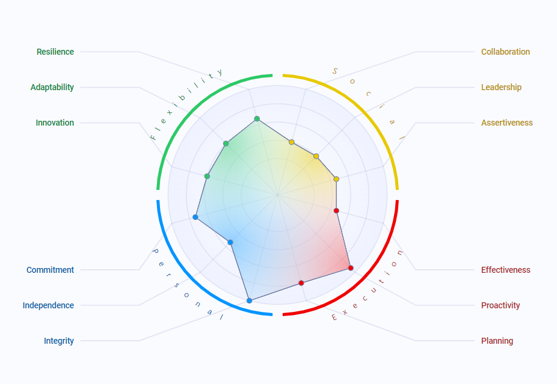

<h3 align="left">Software Engineering.</h3>

If something characterizes you, it's your determination to achieve your goals. You remain calm and solve even the most complicated situations by using your strengths and overcoming your weaknesses. Others see you as a person who doesn't forget the people who matter to you, with whom you also engage in activities and offer your support.

Your strengths:

- You are able to set goals and work towards achieving them.
- People love working with you, you are able to make your team more cohesive and more competent.
- You are one of those people who defend what they consider fair, openly and honestly.

